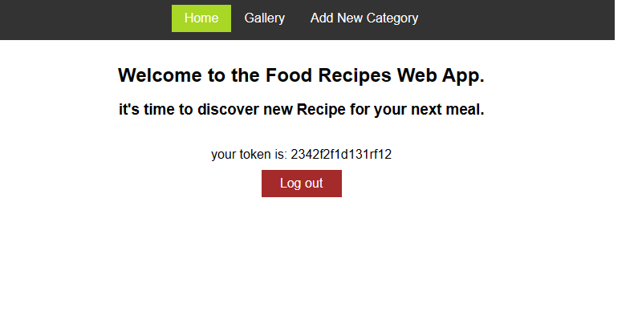
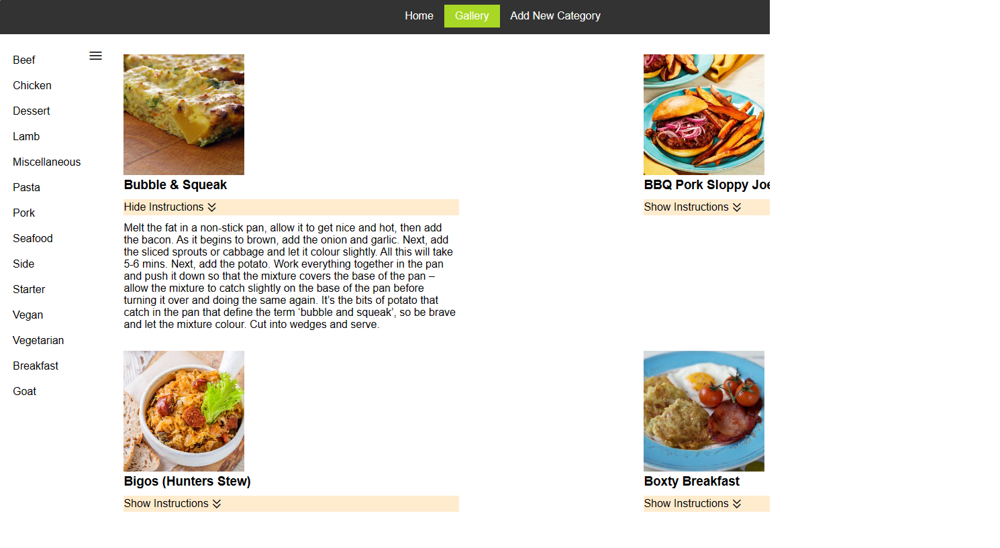
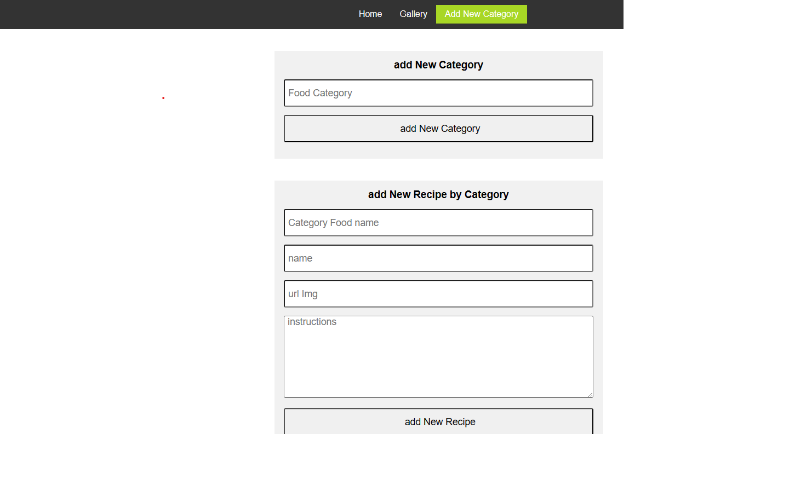

# Food Recipes Web App Using React, Redux, Routing and Authentication

This project covers several software and web concepts:
html, css, dom, oop, singlton and dependency injection with react context, promise, async await, caching with react query, 
share state between components with redux, routing, authentication(simulation), forms, infinite scroll, rest api, static typing and generics with typescript.

This project was bootstrapped with [Create React App](https://github.com/facebook/create-react-app).

## Available Scripts

In the project directory, you can run:

### `npm i`

This command installs a package and any packages that the project depends on.

### `npm start`

Runs the app in the development mode.\
Open [http://localhost:3000](http://localhost:3000) to view it in the browser.

The page will reload if you make edits.\
You will also see any lint errors in the console.

## Learn More

You can learn more in the [Create React App documentation](https://facebook.github.io/create-react-app/docs/getting-started).

To learn React, check out the [React documentation](https://reactjs.org/).
